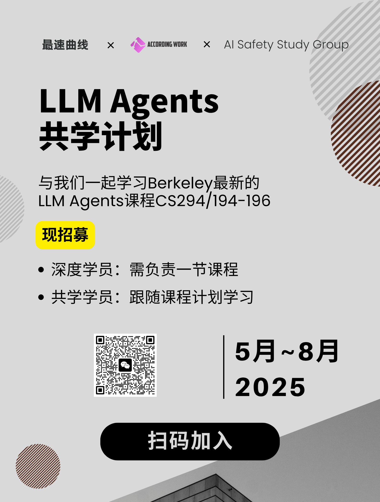

# LLM Agents 共学计划

本课程召集学员共同学习 UC Berkeley 的 LLM Agents 课程。

## 课程介绍

LLM Agents 作为当前最炙手可热的 AI 发展方向，正迅速蔓延到社会的各个领域。掌握 LLM Agents 的原理和应用技术，有助于我们每个人在自己的工作中发挥更大的作用。

UC Berkeley 作为传统 AI 强校，联合众多前沿 AI 实验室，推出了这门课程，旨在帮助学员全面、系统地了解 LLM Agents 的前世今生。其中大部分内容都是业界的最新研究进展，且深入浅出，适合所有对 AI 感兴趣的同学。

课程的官方地址在[这里](https://llmagents-learning.org/f24)。

## 共学计划

从 2025 年 5 月 19 日开始，每周开展一节线上共学课程。课程由深度学员主讲，共学学员一起参与讨论。课程助教负责所有内容的答疑，并布置课后习题，统计学习进度。

有兴趣参与的同学请填写[LLM Agents 共学计划报名表](https://docs.qq.com/form/page/DTWxtR3BrcmVFZVFa)，选择**共学学员**或**深度学员**的角色，并加入”最速曲线技术社区“微信群。

以下是本次共学的相关资源：

| 日期 | 小节名称 | 主讲人 | 视频回放 | 课后习题 |
|---|---|---|---|---|
|2025/5/22| [LLM Reasoning](course-01-llm-agents/chapter-01-llm-reasoning.md) | 一蓑客（According.Work） | [Bilibili](https://www.bilibili.com/video/BV13YjEzhEWD/?share_source=copy_web&vd_source=3f258476a6487ba5ca6427ce85ef2d5f) | [腾讯问卷](https://docs.qq.com/form/page/DTWRUYm5TdENOb1Fn)
| 2025/6/2 | [LLM Agents: Brief History and Overview](course-01-llm-agents/chapter-02-llm-agents-brief-history-and-overview.md) | Rain（江南大学） | [Bilibili](https://www.bilibili.com/video/BV1ef78zKEBD) | [腾讯问卷](https://docs.qq.com/form/page/DTXR0WGRCU2tKa1BR) |
| 待定 | Agentic AI Frameworks & AutoGen + Building a Multimodal Knowledge Assistant | 待定 |  |
| 待定 | Enterprise trends for generative AI, and key components of building successful agents/applications | 待定 |  |
| 待定 | Compound AI Systems & the DSPy Framework | 待定 |  |
| 待定 | Agents for Software Development | 待定 |  |
| 待定 | AI Agents for Enterprise Workflows | 待定 |  |
| 待定 | Towards a unified framework of Neural and Symbolic Decision Making | 待定 |  |
| 待定 | Project GR00T: A Blueprint for Generalist Robotics | 待定 |  |
| 待定 | Open-Source and Science in the Era of Foundation Models | 待定 |  |
| 待定 | Measuring Agent capabilities and Anthropic’s RSP | 待定 |  |
| 待定 | Towards Building Safe & Trustworthy AI Agents and A Path for Science‑ and Evidence‑based AI Policy | 待定 |  |

## 宣传海报

