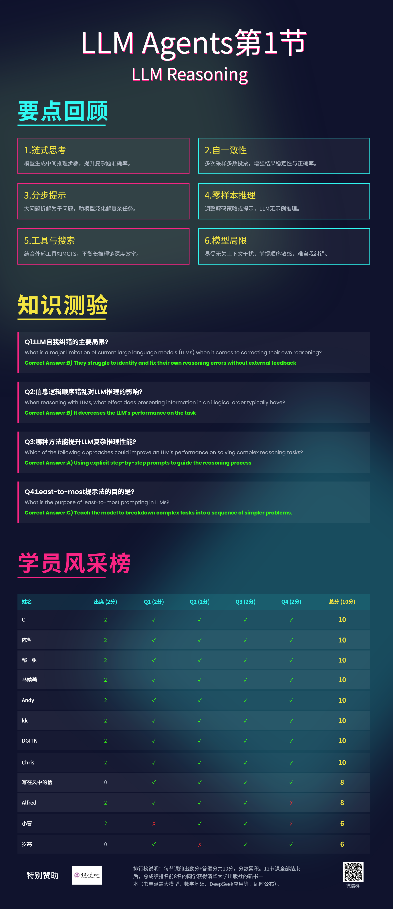

# Chapter 1: LLM Reasoning

## 官方资源

- 主讲人：Denny Zhou（Google DeepMind）
- 课件：[llm-reasoning.pdf](https://rdi.berkeley.edu/llm-agents-mooc/slides/llm-reasoning.pdf)

## 共学计划

- 时间：2025年5月22日 20:00-22:00
- 共学地点：腾讯会议
- 主讲人：一蓑客（According.Work, [X](https://x.com/hunknownz)，[GitHub](https://github.com/hunknownz)）
- 课程回放：[LLM Agents共学计划第1节：LLM Reasoning](https://www.bilibili.com/video/BV13YjEzhEWD)

## 核心内容

- **链式思考（Chain-of-Thought）**：让模型在回答前生成中间推理步骤，显著提升复杂题目的解答准确率。
- **自一致性（Self-Consistency）**：对同一问题多次采样并采用多数投票，有效增强推理结果的稳定性和正确率。
- **分步提示（Least-to-Most）**：将大问题拆解为易到难的子问题，模型能更好地泛化并解决复杂任务。
- **零样本推理**：通过调整解码策略（如非贪心采样）或“let’s think step by step”等提示，LLM 可在无示例情况下进行推理。
- **工具与外部搜索**：当生成过长推理链时，可结合蒙特卡洛树搜索（MCTS）等外部工具，平衡深度和效率。
- **模型局限**：LLM 易受无关上下文干扰，对前提顺序敏感，且尚无法可靠自我纠错，需谨慎设计提示和验证机制。

## 课后习题

1. **What is a major limitation of current large language models (LLMs) when it comes to correcting their own reasoning?**
A) They often misinterpret prompts
B) They struggle to identify and fix their own reasoning errors without external feedback
C) They are too slow to process complex reasoning tasks
D) They require too much memory to handle reasoning corrections
Correct Answer: B

2. **When reasoning with LLMs, what effect does presenting information in an illogical order typically have?**
A) It enhances the LLM's ability to generalize the problem
B) It decreases the LLM’s performance on the task
C) It has no effect on performance as LLMs can reorder information
D) It speeds up the LLM's reasoning process
Correct Answer: B

3. **Which of the following approaches could improve an LLM’s performance on solving complex reasoning tasks?**
A) Using explicit step-by-step prompts to guide the reasoning process
B) Limiting the model's access to information to avoid confusion
C) Removing all sequential steps from reasoning tasks
D) Presenting premises in random order to test adaptability
Correct Answer: A

4. **What is the purpose of least-to-most prompting in LLMs?**
A) Ensure that the model solves each part of a task before moving on to the next one.
B) Provide the model with as much information as possible before it begins reasoning.
C) Teach the model to breakdown complex tasks into a sequence of simpler problems.
D) Select the shortest possible input for maximum model efficiency.
Correct Answer: C

## 互动与反馈

课后习题与反馈问卷：[腾讯问卷](https://docs.qq.com/form/page/DTWRUYm5TdENOb1Fn)

宣传海报：

总结海报：

## 其它

清华大学出版社Yuna老师赞助了我们11本书，作为共学计划的奖励。最终排名前8名的学员每人将获得一本，最受大家欢迎的前3名主讲人也将每人获得一本。