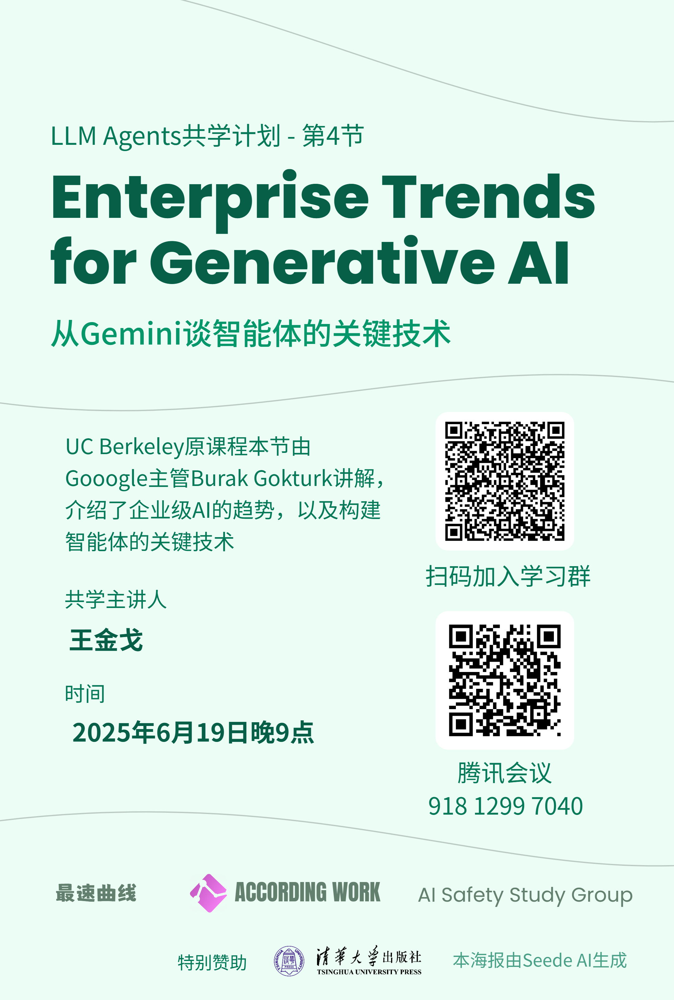

# Chapter 4: Enterprise Trends for Generative AI

## 官方资源

- 主讲人：Burak Gokturk（Google）
- 课件：[Burak_slides.pdf](https://rdi.berkeley.edu/llm-agents-mooc/slides/Burak_slides.pdf)

## 共学计划

- 时间：2025年6月19日 21:00-22:30
- 共学地点：腾讯会议
- 主讲人：王金戈（[Bilibili](https://space.bilibili.com/69217382)）
- 课程回放：[LLM Agents共学计划第4节：Enterprise Trends for Generative AI](https://www.bilibili.com/video/BV1GoKczREyB)

## 核心内容

**五大企业级趋势**
1. AI的发展正在加速，因为AI开发的门槛逐步降低。
2. 模型的演变
    - 任务特定模型 -> 统一模型
    - 稠密模型 -> 稀疏模型(MoE)
    - 单一模态模型 -> 多模态模型
3. AI应用的成功要素
    - 可利用的模型足够多
    - 可根据数据定制模型
    - 高效的应用开发、管理、部署平台
4. API成本逐渐降低，优于私有部署
5. 大模型和搜索需要进一步深度融合

**Agent开发和模型定制的关键技术**
- 微调（fine-tune）
  - 全量微调
  - 提示词微调（prompt tuning）
  - 参数高效微调（PEFT，Parameter-Efficient Fine-Tuning），如 LoRA
- 蒸馏（Distillation）
- 锚定（Grounding）
  - 将参考信息源与回复关联起来
  - 修复回复中的错误和虚假信息
- 函数调用（Function Calling）

## 课后习题

1. **What are the main technical trends we are observing in Generative AI?**
A) Developing smaller, task-specific models optimized for individual applications
B) Focusing solely on improving computational hardware to run larger dense models faster
C) Reducing the size of models to minimize their memory footprint and energy consumption
D) Developing multimodal models that can generalize across millions of tasks
Correct Answer: D

2. **Which of the following is a key success factor for generative AI?**
A) Relying on a single, one-size-fits-all model for all use cases 
B) Investing in a platform that allows for customization of foundation models with your own data
C) Avoiding the use of AI platforms to reduce complexity
D) Limiting model deployment to a single infrastructure provider to ensure consistency
Correct Answer: B

3. **Which of the following is NOT considered a limitation of generative AI?**
A) LLMs have a hard time producing consistently structured output 
B) LLMs often retain outdated information from their training set
C) LLMs can not interact with the world on behalf of a user on their own
D) The cost of API calls to LLMs have become increasing expensive
Correct Answer: D

4. **What is grounding in the context of generative AI, and why is it important?**
A) Grounding aims to improve the factuality of generative AI outputs by aligning them with real-world knowledge
B) Grounding refers to the process of training models on larger datasets to improve performance
C) Grounding focuses on optimizing model speed and reducing computational costs
D) Grounding involves limiting model flexibility to prevent misuse of AI
Correct Answer: A

5. **What is function calling, and why is it crucial for the success of generative AI?**
A) Function calling refers to limiting the number of tasks a model can perform to improve efficiency
B) Function calling is a technique to reduce the size of the model by disabling certain functions
C) Function calling allows generative AI models to interact with external systems or APIs to perform specific tasks, making the models more practical and useful
D) Function calling enables AI models to generate more creative outputs by randomizing responses
Correct Answer: C

6. **微调（fine-tune）和提示词工程（prompt engineering）的区别是什么？**
参考答案：
微调需要使用大量数据训练模型，会改变模型的参数，并消耗大量算力。提示词工程只需要设计提示词，提供少量数据案例，不会改变模型的参数。

7. **举一个你使用ChatGPT或DeepSeek的例子，说明Grounding在其中起到了什么效果。**
参考答案：
打开联网搜索时，AI的回复中涉及事实性信息的部分会带上引用标记，点击可以跳转到相关网页。Grounding的作用就是将其检索到的网页与回复关联起来，以确保准确性，并方便用户核查。

## 互动与反馈

课后习题与反馈问卷：[腾讯问卷](https://docs.qq.com/form/page/DTVZERHVrc0RxTFFO)

宣传海报：

总结海报：