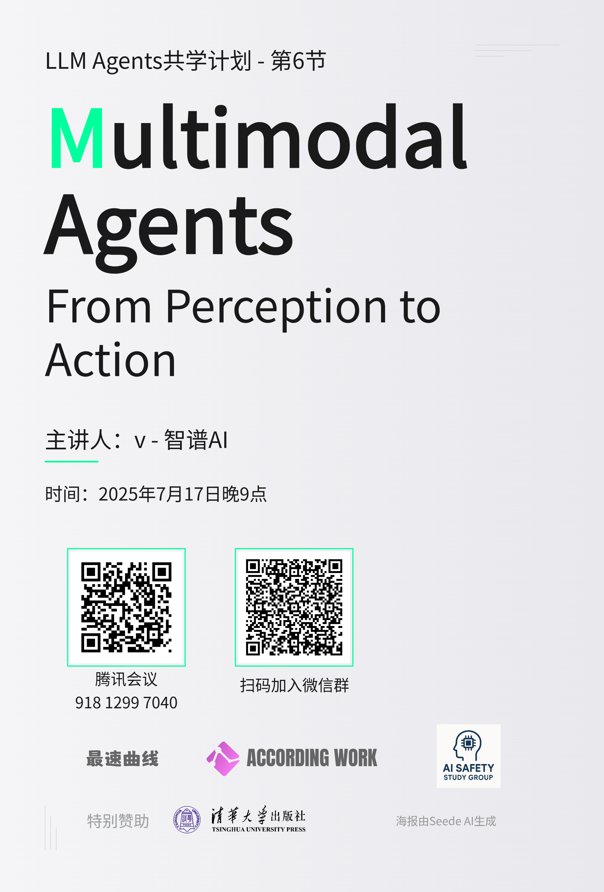

# Chapter 6: Multimodal Agents: From Perception to Action

## 官方资源

- 主讲人：Caiming Xiong（Salesforce AI Research）
- 课件：
  - [Multimodal Agents: From Perception to Action](https://llmagents-learning.org/slides/Multimodal_Agent_caiming.pdf)
  - [OSWorld: Benchmarking Multimodal Agents for Open-Ended Tasks in Real Computer Environments](https://docs.google.com/presentation/d/1-r889Nb9n7SeZqrj-ryNqJLoMzp7aGNU2ihO8nUdEcE/edit?usp=sharing)
- 特别说明：本节内容并不属于LLM Agents课程，而属于Advanced LLM Agents课程。由于主讲人v老师是多模态大模型领域的专家，所以破格选择了这节内容。

## 共学计划

- 时间：2025年7月17日 21:00-22:00
- 共学地点：腾讯会议
- 主讲人：v（[Bilibili](https://space.bilibili.com/391911247)）
- 课程回放：[LLM Agents共学计划第6节：Multimodal Agents: From Perception to Action](https://www.bilibili.com/video/BV1vgu9zmEPb)

## 核心内容

**OSWorld**是一个真实电脑环境下的多模态智能体基准测试平台。
+ **背景与挑战**：缺乏可扩展的真实交互式环境，限制了智能体在复杂、真实世界电脑任务中的应用和评估。
+ **OSWorld 解决方案**：提供统一的多模态智能体环境，用于评估涉及任意应用程序和操作系统的开放式电脑任务。
+ **任务定义**：将智能体任务形式化为部分可观测马尔可夫决策过程，包括状态、观测、动作和奖励函数。
+ **评估**：采用基于执行的奖励函数进行评估。
+ **数据集**：包含 369 个真实世界的电脑任务，涵盖网络和桌面应用、文件 I/O 和多应用工作流。
+ **基准测试结果**：现有大型语言模型/视觉语言模型在真实电脑任务中仍与人类表现存在差距；输入设置（如可访问性树和截图）的效果因模型而异。
+ **未来研究**：提升能力（交互式学习、创新基础模型）、可靠性和安全性、个性化以及效率。

## 课后习题

1. **What is the primary problem that the OSWORLD benchmark aims to solve?**
A) To create a faster training environment specifically for gaming AIs.
B) To develop a new programming language to make coding easier for agents.
C) To address the limitations of existing benchmarks that lack real-world interactivity or are confined to specific applications.
D) To build a system that automatically repairs operating system errors.
Correct Answer: C

2. **In the OSWORLD environment, what is the primary way for an agent to execute an action?**
A) By sending direct voice commands to the operating system.
B) By generating Python code using the pyautogui library to simulate mouse and keyboard inputs.
C) By directly modifying the operating system's kernel files.
D) By making API calls to a specific web service.
Correct Answer: B

3. **How does OSWORLD protect the host computer from potential damage by the agent?**
A) By running all agents on a separate, air-gapped computer.
B) By strictly limiting the agent to read-only actions.
C) By using advanced antivirus software to monitor the agent.
D) By utilizing virtual machines to create a safe, isolated environment for the agent to operate in.
Correct Answer: D

4. **What are the two main types of observation information provided to the agent in OSWORLD?**
A) Audio from the microphone and text from a command line log.
B) A complete desktop screenshot and an accessibility tree (a11y tree).
C) A list of running processes and network traffic data.
D) The computer's temperature and CPU usage statistics.
Correct Answer: B

5. **According to the paper's evaluation, what is a frequent type of error for current AI agents?**
A) They generate code that is syntactically incorrect.
B) They fail to understand the task instructions written in natural language.
C) They experience "mouse click inaccuracies," failing to click on the correct coordinates.
D) They run out of memory due to inefficient code.
Correct Answer: C

6. **What is a key capability of OSWORLD that distinguishes it from many prior benchmarks?**
A) It is designed exclusively for the macOS operating system.
B) It can evaluate an agent's ability to perform complex workflows across multiple different applications.
C) It guarantees a 100% success rate for all tested agents.
D) It uses a single, universal evaluation script for every task.
Correct Answer: B

7. **本节介绍的OSWORLD用于评估多模态智能体在计算机操作中的表现。结合你的经验，你认为这类智能体在实际生活中有哪些潜在应用场景？同时，在实现这些应用的过程中，可能会面临哪些挑战？**
参考答案：
最直接的应用场景就是每个人的手机助手。我们可以把手机上的重复性的工作交给AI来做，比如搜索信息、打开视频或音乐、点外卖、交电费、查账单等等。
有两个问题可能是比较大的挑战：
（1）遇到全新的软件，AI需要自行摸索出使用方式，并达到较高的成功率。随着AI能力的逐渐增强，这一问题会得到缓解。
（2）一旦操作失误，或许会造成数据损失、隐私泄露及其它不可逆的影响。如何合理地赋予AI权限，将会是一个值得考量的问题。

## 互动与反馈

课后习题与反馈问卷：[腾讯问卷](https://docs.qq.com/form/page/DTUxqUGpNY1huQXZp)

宣传海报：