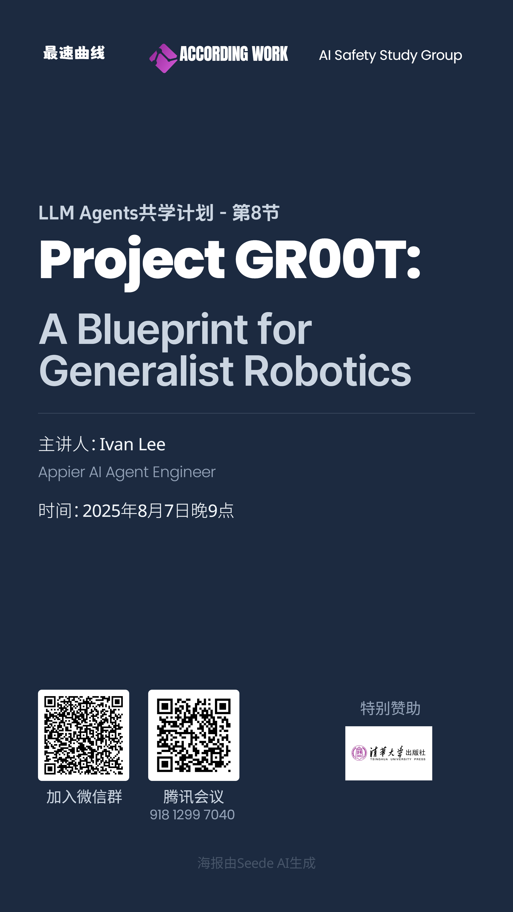

# Chapter 8: Project GR00T: A Blueprint for Generalist Robotics

## 官方资源

- 主讲人：Jim Fan（NVIDIA）
- 课件：[Project GR00T: A Blueprint for Generalist Robotics](https://rdi.berkeley.edu/llm-agents/assets/jimfangr00t.pdf)

## 共学计划

- 时间：2025年8月7日 21:00-22:30
- 共学地点：腾讯会议
- 主讲人：Ivan Lee（[Bilibili](https://space.bilibili.com/361204826)，[GitHub](https://github.com/leeivan1007)）
- 课程回放：[LLM Agents共学计划第8节：Project GR00T: A Blueprint for Generalist Robotics](https://www.bilibili.com/video/BV1iWt1zrEo2)
- 课件：[Project GR00T: A Blueprint for Generalist Robotics](https://docs.google.com/presentation/d/1L1WDIwPtbFvhm6dtjkXOwITZGaV6yogdTLEt3TNy9LY/edit?usp=sharing)

## 核心内容

在通用大模型席卷而来的当下，NVIDIA 抛出了自己的通用智能体蓝图——GR00T。依托 OSMO 这一原生生态，NVIDIA 为机器人准备了三大「外挂」：
1. Embodiment：把任意关节与肢体抽象成轻量 embedding，模型拿到这份「身体说明书」即可零样本适配，灵活运动。
2. Skill：
    + MiMicGen / DexMimicGen——只需一段单手或双手示教，就能批量合成海量数字训练素材；
    + Eureka——把任务描述喂给大语言模型，自动生成奖励函数并迭代优化，让 Agent 的表现在仿真里步步高升。
3. Reality：
    + HOVER——统一多种控制接口，保证人形机器人的动作在真实硬件上同样优雅；
    + DrEureka——用语言模型刻画不同物理环境，实现跨域训练→真实部署的无缝迁移。

## 课后习题

1. **GR00T的三大原则包括**（多选）
A) Data Pyramid
B) The Matrix
C) Multiply Data
D) Foundation Agent
E) Automated Feedback
Correct Answer: A, B, D

2. **在 GR00T 的「Skill」与「Reality」两大维度中，Eureka（技能维度）通过大语言模型自动生成并迭代优化奖励函数，而DrEureka（现实维度）则利用同样的机制来搜索、调整物理环境与仿真参数。以下哪一项最准确地概括了二者提升“多样性（diversity）”的共同底层机制？**
A) 基于规则的脚本引擎，通过穷举组合产生新任务
B) 大语言模型（LLM）+ 迭代式提示优化，自动生成并改良奖励函数或场景参数
C) 纯随机采样策略，每次从零开始重新生成奖励函数和场景配置
D) 人工专家手动设计并定期更新任务库与环境库
Correct Answer：B
Explanation：Eureka与DrEureka都依赖大语言模型（LLM）作为统一生成器，通过提示-评估-再提示的闭环迭代，持续改进奖励函数或物理环境配置，从而扩展任务与场景的多样性。

3. **我们的仿真训练需要源源不断的新场景，而传统手工建模费时费力。NVIDIA 为此开源了 RoboCasa——一个能够程序化、参数化地批量生成室内交互环境的工具。RoboCasa 在 GR00T 体系中被官方归类为哪一类框架？**
A) 高精度物理求解器
B) 强化学习算法库
C) 生成式仿真框架
D) 机器人硬件抽象层
Correct Answer：B
解析：RoboCasa 通过程序化生成方式，自动构建多样化、可交互的室内仿真场景，因此被官方明确定义为“生成式仿真框架”。

4. **站在 2025 年的时间节点回望，机器人已从工厂机械臂演进为通用人形与潜在AGI智能体。关于其“终极目标”，学界和产业界始终众说纷纭：有人主张“服务人类”，有人设想“超越人类”，也有人担忧“替代人类”。请结合你对技术趋势与社会需求的观察，用 1–2 句话阐述：你认为机器人最终必须解决的核心问题是什么？**
Answer: 机器人最终必须解决的核心问题是「在增强人类而非取代人类的前提下，让物理世界中的长尾、复杂任务实现『零门槛自动化』，从而释放人类创造力，并确保技术红利普惠而非集中」。

## 互动与反馈

课后习题与反馈问卷：[腾讯问卷](https://docs.qq.com/form/page/DTWhKV3NEcm15YU9o)

宣传海报：