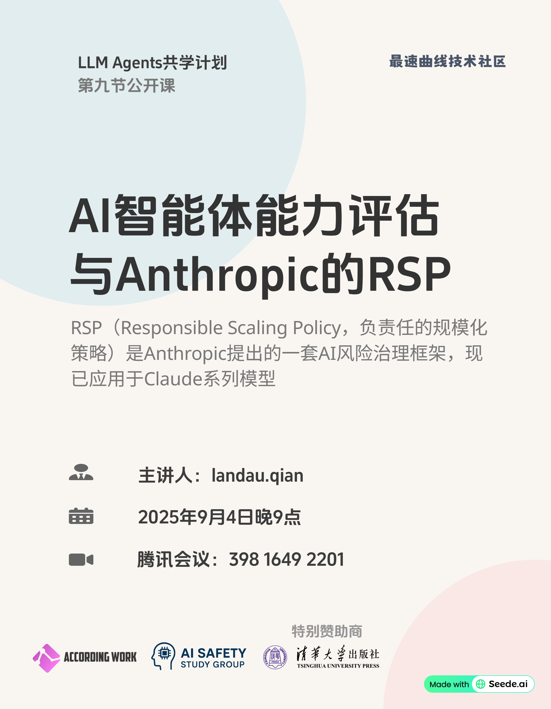

# Chapter 9: Measuring Agent capabilities and Anthropic’s RSP

## 官方资源

- 主讲人：Ben Mann（Anthropic）
- 课件：[antrsp.pdf](https://llmagents-learning.org/slides/antrsp.pdf)

## 共学计划

- 时间：2025年9月4日 21:00-22:00
- 共学地点：腾讯会议
- 主讲人：landau.qian（[Bilibili](https://space.bilibili.com/1008675263)）
- 课程回放：[LLM Agents共学计划第9节：Measuring Agent capabilities and Anthropic’s RSP](https://www.bilibili.com/video/BV11ha8zxEG6)

## 核心内容

**RSP是什么？**

Responsible Scaling Policy (RSP) 是 Anthropic 提出的“负责任的扩展策略”：在提升 AI 模型能力的同时，确保安全措施与风险管理同步升级。

**为什么需要RSP？**

随着模型能力快速增强，可能带来更大社会风险。RSP的目标是：不让模型能力跑在安全保障之前，通过分级标准和承诺，避免失控发展。

**RSP具体是怎么实现的？**

+ 分级管理（AI Safety Level, ASL）：将模型风险划分为不同等级（ASL-1 到 ASL-4），每一阶段都有明确的安全标准。
+ 严格测评：通过 METR 等内外部评测体系，持续检验模型的真实能力和潜在威胁。
+ 部署约束：能力到达更高等级前，必须先完成相应的安全对策和治理流程。

## 课后习题

1. **What is NOT a goal of Anthropic’s Responsible Scaling Policy (RSP)?**
A) Learning how to make and improve safe decisions
B) Holding the public responsible for using models appropriately
C) Providing structure for making difficult safety decisions
D) Offering a template for policymakers and industry professionals
Correct Answer: B

2. **What is NOT a safety risk of LLM agents?**
A) Agents may enhance their own capabilities without human oversight or intervention
B) Agents have difficulty distinguishing between primary and embedded instructions that may be from a malicious attacker
C) Agents take action based on their input and can become an exploitable method of accessing sensitive information
D) Agents can perform tasks that take 30 minutes for human developers in just seconds
Correct Answer: D

3. **How is Anthropic’s RSP implemented?**
A) By immediately halting model development once a potential risk is detected, regardless of the ASL
B) By relying solely on external policymakers to define and enforce safety standards
C) By applying uniform safeguards across all AI models, regardless of their capability level
D) By categorizing AI capabilities and corresponding safeguards into progressive AI Safety Levels (ASLs) and responding to identified triggers
Correct Answer: D

4. **你认为AI公司是否需要承担AI安全治理的重要责任？为什么？**
参考答案：是的。虽然政府和监管机构在制定法规和政策方面发挥着重要作用，但AI公司作为技术开发者，拥有对其产品的深入理解和控制权，因此应承担重要责任，确保其技术的安全性和伦理性。

## 互动与反馈

课后习题与反馈问卷：[腾讯问卷](https://docs.qq.com/form/page/DTWhwUWhwYXZzZVhW)

宣传海报：