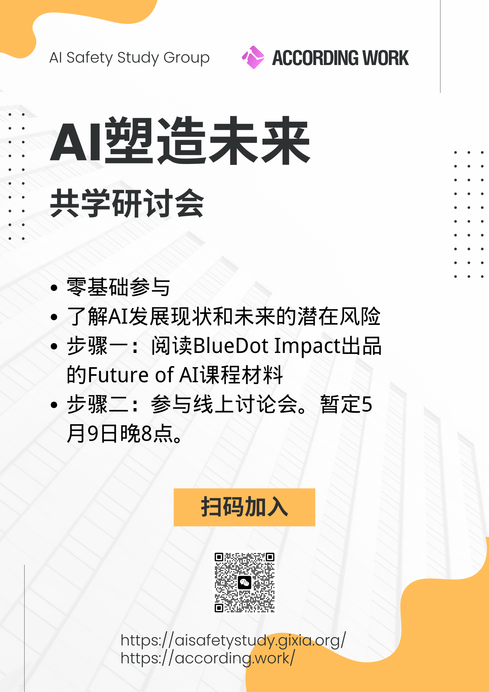

# AI塑造未来共学研讨会

+ **日期**：2025年5月9日
+ **时间**：20:00~21:00
+ **主持人**：王金戈

参与者共同学习Future of AI课程，并开展了一个多小时的线上讨论，内容涉及AI的发展现状，对社会、就业、人价值观的影响，以及AI的成本、能源消耗、可解释性、去中心化等议题。

以下是本次活动的有关链接：
1. BlueDot Impact的官方课程：[Future of AI](https://course.bluedot.org/future-of-ai)
2. [讨论会的流程文档](https://docs.qq.com/doc/DTWdMcGhsSXJyTU5o)
3. [腾讯会议录制与AI总结](https://meeting.tencent.com/crm/lRZEWzEWf7)
4. Bilibili投稿：[AI塑造未来：共学研讨会](https://www.bilibili.com/video/BV129VSziE67)

未参与的同学可以查看1、2、4，回顾整个活动内容。

活动海报：