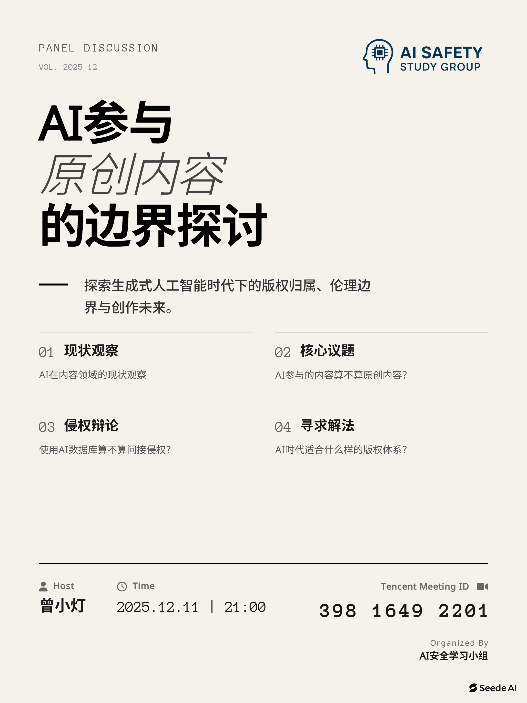

# AI参与原创内容的边界探讨

——探索生成式人工智能时代下的版权归属、伦理边界与创作未来

+ **日期**：2025年12月11日
+ **时间**：21:00~23:00
+ **地点**：线上腾讯会议
+ **主持人**：曾小灯

### AI总结

本次会议围绕AI技术对创作、身份及社会结构的影响展开讨论，探讨了其创作边界、知识产权争议以及对个人竞争力的重塑。探讨的话题如下。

**AI在内容创作中的边界与价值​​**

+ **存在问题**​​：当前主流AI（如DeepSeek）生成的内容存在“形式大于内容”的问题，表现为结构化强但思想性不足，易犯“一本正经的胡说八道”或“幻觉”错误。
+ **适用场景**​​：AI在以下三种场景下应用价值较高：一是​​应付型内容​​（要求不高，用于满足初步需求的场景）；二是​​结构化/应用型写作​​（如新闻稿），依赖客观事实而非主观观点；三是​​批量内容生产​​（如历史故事仿写），适用于有固定模板和大量重复产出的需求。
+ **​明确局限**​​：AI不具备代替创作者表达​​个人观点​​或进行​​深度原创​​的能力，尤其是在涉及创新性、批判性思维和复杂情感表达等领域。

**​​对创作观点与AI界限的探讨​​**

+ **​核心矛盾**​​：会议从根本上质疑了将创作归因于AI的合理性。主张应认识到AI本身就是对海量人类语言和知识的集合与提炼，从根因上而言，其源头仍是人。
+ **​本末倒置的风险**​​：当前的趋势是，人们在用自己的创作时，被AI的表达形式所反向评判，这被认为是一种不合理的本末倒置，可能导致对真正原创者价值的误读。

**行业竞争格局与未来发展方向​​**

+ **​人机分工演化**​​：未来组织形态可能趋向小型化和微型化，“一人公司”模式兴起。在此生态系统中，资源型（获取流量/客户）、统筹型（管理协调）人才因难以被AI替代而具备更高价值和竞争力，而纯技术/执行型工作则易被替代。
+ **​职业方向揭示​**​：适应未来职场的关键在于明确自身职业路径的分类。对技术/执行岗：需认清AI不可替代的部分，专注精进“人”的优势，提升技能标准；对资源/统筹型岗位：需具备跨领域能力、紧跟行业动态、精通AI工具并建立内在工作标准。
+ **​终极命运展望**​​：会议对AI与人类竞争的结局存在多种猜想，包括人类最终向精神世界升华，或是AI的发展强制人类进入精神追求的方向。

### 相关资料

+ [腾讯会议录制](https://meeting.tencent.com/cw/l7A7jdjxe6)
+ 海报：