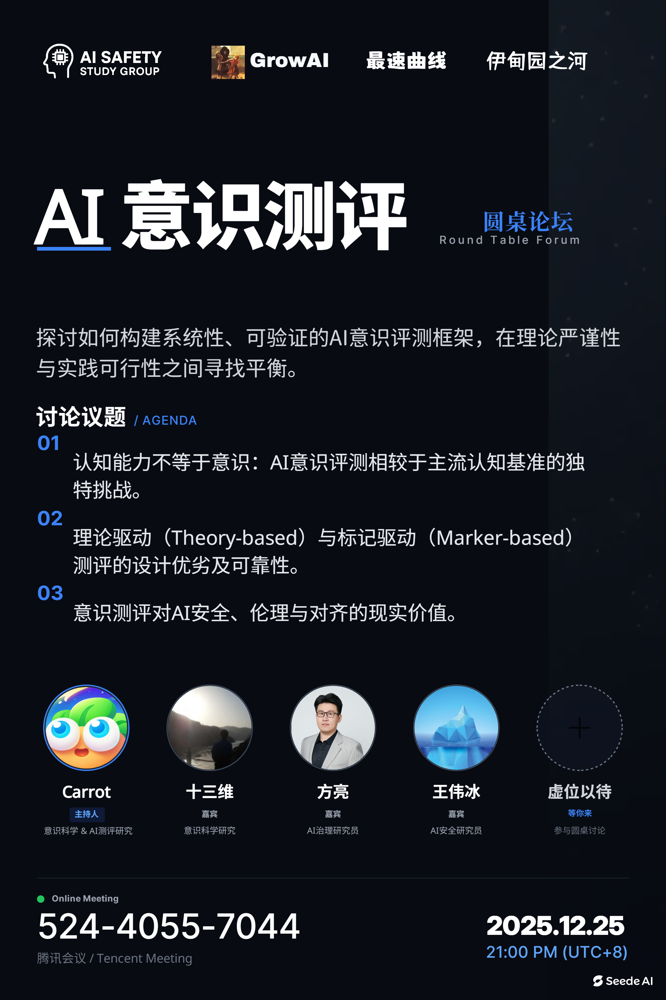

# AI意识评测圆桌论坛

### 背景

+ **日期**：2025年12月25日
+ **时间**：21:00~23:00
+ **地点**：线上腾讯会议
+ **主持人**：Carrot
+ **对谈嘉宾**：十三维，方亮，王伟冰
+ **合作伙伴**：GrowAI，最速曲线技术社区，伊甸园之河

2025年，“AI是否拥有意识”这个问题越来越受到人们的关注。作为AI领域的从业者和研究者，我们更关心科学界如何看待这一问题，如何在意识科学、AI伦理、AI安全等多方视角下寻求共识。

本次，我们有幸请到了从事意识科学和AI测评研究的Carrot老师、从事意识科学研究的十三维老师、从事AI安全和治理研究的方亮老师和王伟冰老师集聚一堂，共同讨论AI意识测评问题。

这次圆桌论坛包含两部分。第一部分Carrot老师用40分钟做了一个AI意识的综述性讲座。第二部分，Carrot老师与三位嘉宾展开时长一个半小时的对谈。如果你对AI意识、AI伦理、AI安全等话题感兴趣，这次对谈绝对是目前中文互联网上最值得认真观摩的内容，干货极多。

### 论坛大纲

**主题简介**

AI意识是当前AI伦理、安全与对齐研究的重要议题。一些理论框架推测，有意识的AI可能带来多种不同的存在风险 (existential risks/x-risks) 与痛苦风险 (suffering risks/s-risks)。具体来说，意识可能与超级智能有机制层面的相关性，从而带来诸如欺骗性对齐、目标泛化失败、工具性自我保护等风险。同时，根据特定相对主流的伦理学观点，有意识的系统可能满足道德适虑性 (moral patienthood) 与道德主体性 (moral agenthood)，从而使AI的福祉 (welfare) 与归责 (responsibility) 问题成为现实考量。另外，也有一些观点认为意识可能是情感同理心 (affective empathy) 等稳健的价值对齐 (robust value alignment) 的核心条件，从而使得AI意识成为潜在的对齐目标或安全保障机制。

总体来说，这些争论使得系统且科学的AI意识测评成为理解AI风险、确保AI安全、以及制定AI治理政策的重要挑战。当前缺乏系统性且经过充分验证的AI意识评测框架与方法论。这一研究空白源于多重困难：意识理论的多元性与争议性、AI系统与生物系统的根本差异、以及评测方法的验证难题。同时，现有的AI评测通常缺乏系统性且科学的理论框架，而有效的意识测评必定需要跨学科的理论基础和方法论工具。鉴于此，本次讨论旨在探讨AI意识评测的核心方法论问题，特别关注如何在理论严谨性与实践可行性之间找到平衡。

**讨论议题示例**
+ AI意识的评测与当前主流的认知基准架设 (cognitive benchmarking) 有何不同？有什么可以借鉴的方法论与实践经验？
+ 基于理论 (theory-based) 的AI意识评测的优劣；如何设计良好的基于理论的AI意识评测框架？不同意识理论 (theories of consciousness) 如何影响评测设计？
+ 基于标记 (marker-based/indicator-based) 的AI意识评测：该方法的可靠性与局限性；如何识别和验证有效的意识标记
+ AI意识评测的价值：理解AI意识对AI伦理、安全与对齐有多重要？尤其相比当前的其他研究方向

### AI总结

这是一场关于AI意识测评的跨学科研讨会。会议主要探讨了AI意识的定义、理论框架及其与AI安全和伦理的关系。参会者从认知科学、哲学和AI安全等不同视角出发，讨论了AI意识测评的现状和未来研究方向。

1. AI意识测评的背景与概念
    + 介绍了AI意识测评的背景，强调这是一个跨学科的话题，涉及AI安全研究和意识科学。
    + 区分了现象意识、态势感知和可信度等概念，指出这些概念在AI意识讨论中经常被混淆。
2. AI意识的理论基础
    + 讨论了计算功能主义，认为如果AI系统满足特定的计算条件，就可能拥有意识。
    + 提到了中国脑和中文房间等思想实验，探讨了计算功能主义的争议和局限性。
3. AI意识与安全风险
    + AI意识可能带来两种风险：对人类的存在风险（existential risk）和AI福祉（AI welfare）问题。
    + AI意识可能与动机和行为相关，尤其是欺骗性行为和对齐问题。
4. AI意识的评测方法
    + 目前AI意识的评测主要分为理论驱动（theory-based）和标记驱动（marker-based）两种方法。
    + 理论驱动方法通过检查AI系统的架构是否满足意识理论的条件；标记驱动方法通过观察AI的行为表现来判断意识。
5. AI福祉与社会影响
    + AI福祉问题涉及如何道德地对待AI，类似于动物伦理问题。
    + 公众对AI意识的看法可能影响AI的治理和社会接受度。
6. AI意识的未来研究方向
    + 需要进一步研究AI意识的机制，尤其是与AI安全和治理的关系。
    + 双向对齐（human-AI alignment）可能是一个重要的研究方向，涉及AI与人类价值观的协调。

### 后记

Carrot老师一直关注AI意识及其伦理和安全问题，我（王金戈）从今年（2025年）夏天开始也对此颇感兴趣。于是我们一拍即合，决定组织这场圆桌论坛。现场看来，效果非常好。我们请到的几位嘉宾来自不同领域，恰好提供了观察AI意识的不同视角。十三维老师浸淫意识科学领域多年，对多种意识理论都有深入研究，而且有自己的独到见解。方亮老师是AI治理领域的专家，提供了宏观视角的重要观点。王伟冰老师目前从事AI风险测评研究，清晰阐述了AI意识与AI安全的关系。

可以说，这次论坛干货极多。Carrot老师最初的40分钟讲座把国际上AI意识领域的发展历史做了极其清晰的梳理，对于初次接触该领域的人来说帮助巨大。讨论阶段，“计算功能主义”成为一个核心话题。往往关注AI意识并重视其风险的人都是计算功能主义的信奉者。他们认为意识的本质是通过计算产生的功能。只要一个系统具备与人脑相同的计算过程，它就应该拥有意识。计算功能主义不在乎计算所依赖的基质，碳基、硅基都可以。显然，这个假设并非所有人都认同。有一种观点认为意识必须存在于生命形式中，必须是一种动态、有机、连续的过程，无法用现有的机器模拟，至少无法在冯诺依曼架构计算机中实现。十三维老师详细阐述了这方面的观点和理论。

该领域的研究从今年开始，逐渐变得热门。只是，国内真正严肃讨论此话题的人和活动几乎没有。我们希望此次论坛为国内相关领域的研究者打开交流的通道，共同探索这一最神秘也最前沿的话题。

### 相关资料

+ [Bilibili视频](https://www.bilibili.com/video/BV1THBvBzECQ)
+ [腾讯会议录制](https://meeting.tencent.com/cw/2Mjz7ExV46)
+ [大纲](https://docs.google.com/document/d/1J2xJ8xnGGTBK5eY7x0k1UAIFYefMFEdumZ3AO5w8w0I/edit?tab=t.0)
+ [PPT](https://docs.google.com/presentation/d/1AdOExNIvrRmvO0qCXWJPNkGdqJ8fqJKMTaeuCEwq93Q/edit?usp=sharing)
+ 海报：