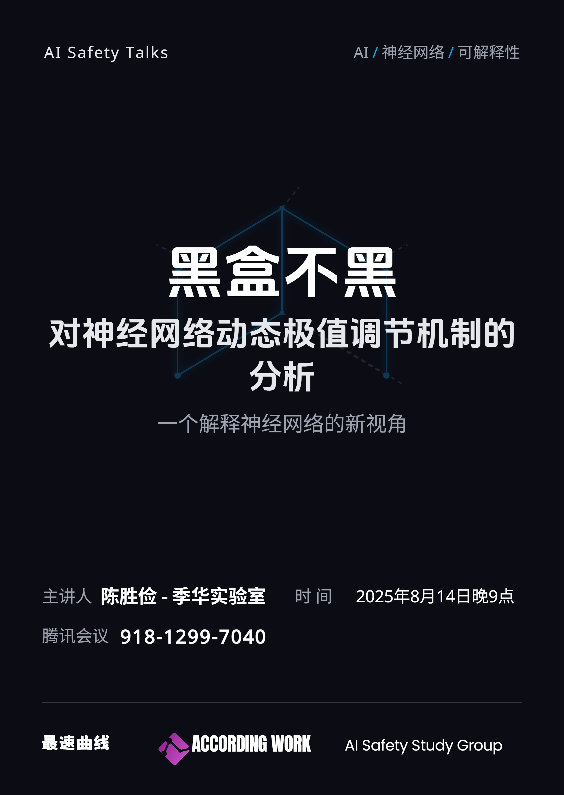

# 黑盒不黑：对神经网络动态极值调节机制的分析

+ **日期**：2025年8月14日
+ **时间**：21:00~21:30
+ **主讲人**：陈胜俭 - 季华实验室
+ **联系方式**：chshengj@mail2.sysu.edu.cn，chensj@jihualab.ac.cn

季华实验室的陈胜俭老师为大家讲解了他的最新工作，从动态极值调节的角度解释神经网络的工作原理，并提出了与反向传播算法（BP）完全不同的新算法，实现更准确、可解释的神经网络训练。

以下是本次活动的有关链接：
+ [PPT](https://docs.qq.com/pdf/DTU9XYmRDbHpEaWpw)
+ [论文](https://arxiv.org/abs/2507.03885)
+ [博客解读](https://zhuanlan.zhihu.com/p/1929473151403790983)
+ [视频](https://www.bilibili.com/video/BV1zWbHz7EZ1)
+ [腾讯会议](https://meeting.tencent.com/cw/KPvA3LAw8a)

对此研究感兴趣的朋友可以直接观看视频讲解，或阅读陈老师的博客解读。如需进一步了解详情，再阅读完整论文。

活动海报：