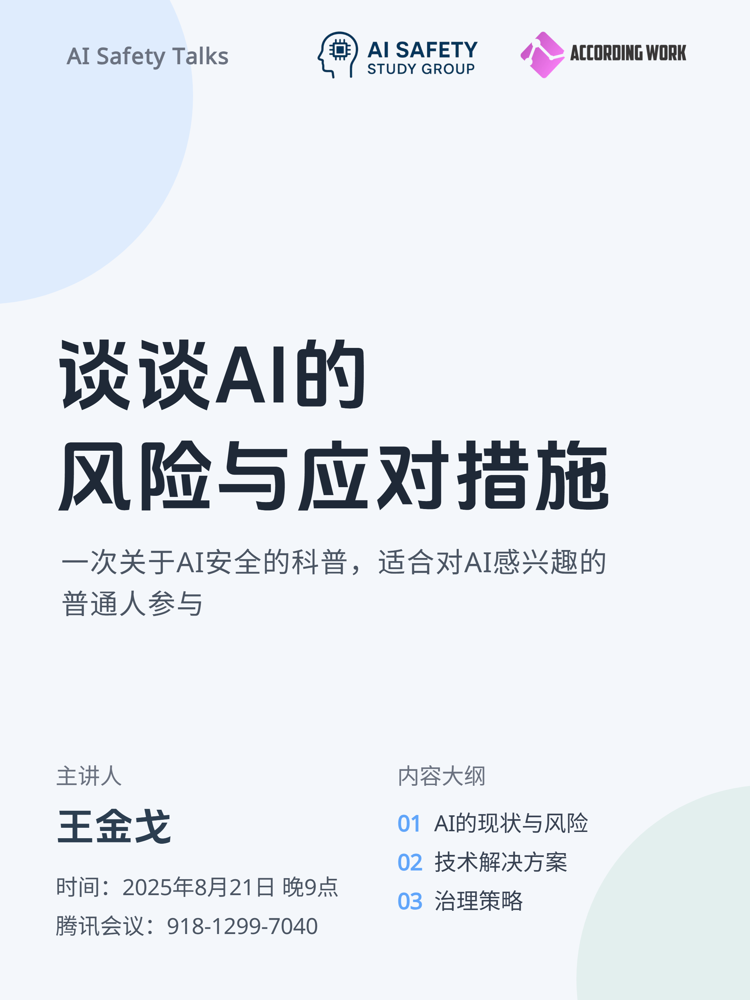

# 谈谈AI的风险与应对措施

+ **日期**：2025年8月21日
+ **时间**：21:00~21:30
+ **主讲人**：王金戈
+ **联系方式**：wjg172184@163.com

最近受邀给观察者网夏令营做了一个AI安全的科普讲座，正好趁此机会再公开讲一遍。AI安全涉及的范围很大，这次我们不介绍太多细节，而是从宏观的角度了解一下AI发展到了什么程度、AI有哪些风险、应对风险的技术手段以及AI治理策略。希望对AI感兴趣的普通人可以来听听这些内容，它们或许会让你对今后的生活和职业生涯有所改观。

以下是本次活动的有关链接：
+ [PPT](https://docs.google.com/presentation/d/1jjEhswKR33UhZ_phBA4Yt4vq4hikuhOyc4N488Tt9C0/edit?usp=sharing)
+ [视频](https://www.bilibili.com/video/BV1mHebz8E26)

活动海报：