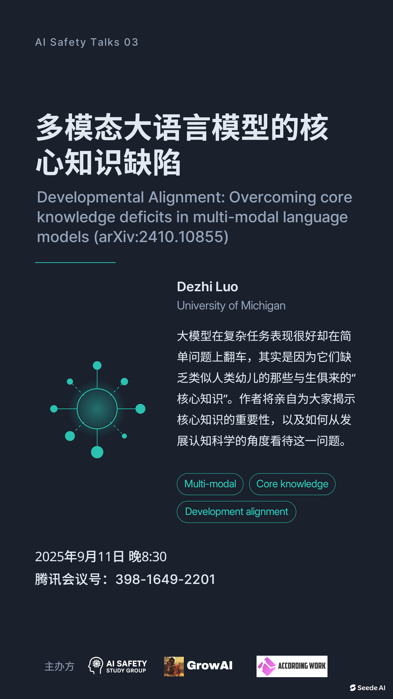

# 多模态大语言模型的核心知识缺陷

+ **日期**：2025年9月11日
+ **时间**：20:30~21:30
+ **主讲人**：Dezhi Luo
+ **个人主页**：https://ihzedoul.com/
+ **小红书**: [carrot](https://www.xiaohongshu.com/user/profile/61a4a25f0000000010005e09?xsec_token=YBAFHyOCcEYkx1obQ0x8k5OJE8GxiXU1BEcSCPWAkCSJc=&xsec_source=app_share&xhsshare=CopyLink&shareRedId=ODY2Q0k7N0I2NzUyOTgwNjY0OTdGSUtN&apptime=1758116399&share_id=fa8101cb61ec4b1d99ba37de8c8825eb)

Dezhi Luo现为密歇根大学认知科学本科生，曾在伦敦大学和伦敦大学学院访学，研究方向包括认知科学、意识科学、人工智能等。[GrowAI](https://growing-ai-like-a-child.github.io/)发起人之一，致力于将认知科学、心理学、哲学等领域的“发展心理学” / 核心知识理论引入人工智能研究中，通过设计“成长式”的训练路径，让模型像孩子一样从基础常识核心认知开始发展。

## 内容总结

**1. 研究背景与问题提出**

* 大语言模型（LLMs）和多模态大语言模型（MLLMs）在高阶推理任务上表现出色，但在一些最基本的常识和认知能力上反而表现糟糕。
* 这种“高阶能力优异、低阶能力缺失”的现象，被称为 **核心知识缺陷（core knowledge deficits）**。
* 稳健性（robustness）问题与缺乏常识紧密相关，是现实世界中部署智能体的关键挑战。

**2. 哲学与认知科学视角**

* 历史上关于知识起源有两种观点：
  * **先天论（innatism）**：知识是与生俱来的。
  * **经验论/实用主义（empiricism/pragmatism）**：知识来自学习，先天只具备通用学习机制。
* 人类发展心理学研究（如皮亚杰的分阶段理论）表明：
  * 人类的高阶认知能力是逐级发展、建立在低阶核心知识之上的。
  * 核心知识包括对物体恒常性、空间、因果关系等的基本理解，这些是后续学习和推理的基石。

**3. 实证研究：发展性基准测试（Developmental Benchmarking）**

* 研究团队设计了受发展心理学启发的 **12类认知能力测试**（如物体恒常性、直觉物理、机械推理）。
* 结果发现：
  * 模型在高阶任务上的表现明显好于低阶任务。
  * 模型规模变大时，高阶任务表现提升明显，但低阶任务表现提升有限，甚至部分任务随规模增大而下降。
* 结论：多模态大模型确实存在 **核心认知缺陷**，低阶常识性知识没有被有效掌握。

**4. 启示与改进方向**

* **核心问题**：大模型的高级推理并非像人类一样建立在低阶常识之上，导致缺乏稳健性。
* **潜在解决方案**：
  * 引入 **发展对齐（developmental alignment）** 思路：模拟人类认知发展过程，让模型在训练中逐级学习，从基础常识到高阶推理。
  * 使用 **cognitive prototyping** 方法：设计并生成体现核心知识的训练数据，帮助模型建立低阶能力表征。
  * 通过知识蒸馏、具身交互等方式，加强模型对核心认知的掌握。

**5. 对AI安全与AGI的意义**

* 发展对齐不仅有助于提升模型稳健性和可解释性，也可能是迈向 **人类水平智能（human-level intelligence）** 的必要路径。
* 从AI安全角度看，若模型缺乏核心知识，可能在复杂环境中做出荒谬或危险的决策，因此这一研究方向至关重要。

简而言之：**多模态大模型虽然在复杂推理上表现优异，但缺乏人类儿童具备的核心常识；若要实现真正稳健、安全的智能，需要在训练中引入发展心理学式的“发展对齐”。**

## 相关资源

由于本次分享涉及版权问题，且包含尚未发表的研究内容，视频暂不公开发布在Bilibili上。感兴趣的朋友可以通过以下方式获取（两个链接内容相同）：

+ [百度网盘](https://pan.baidu.com/s/1FNQEjEsQsouzR0WUqHM2CQ?pwd=4jtj)
+ [Google Drive](https://drive.google.com/file/d/1oOGgvfKXz1FjpIQjjjTvPRpNjiY6mYU7/view?usp=sharing)

活动海报：